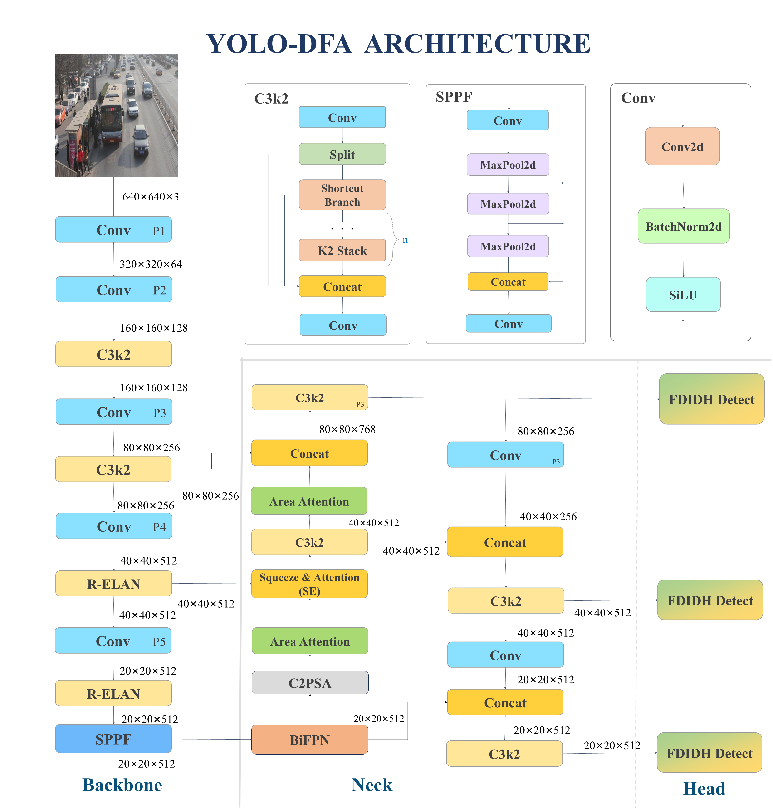

# 🧠 Traffic Sense AI — Intelligent Real-Time Traffic Monitoring System

> **Traffic Sense AI** is a research-driven, full-stack system built for **real-time multi-stream traffic analysis**, powered by enhanced YOLO variants — including our state-of-the-art **YOLO-DFA (Dynamic Feature Aggregation)** model.
> Designed to deliver **live vehicle detection, counting, analytics, and model benchmarking**, this platform merges deep learning, computer vision, and full-stack engineering into one seamless solution.

---

## 🚀 Example Visuals


---

## 🚦 Overview

Traffic Sense AI allows users to run **simultaneous object detection** across up to 4 video sources — whether live streams, YouTube links, or uploaded videos — all through an intuitive web dashboard.

It features:

* **Multi-model YOLO integration** (9 models including YOLOv8, YOLOv8-FDD, FDIDH+DWR, FDIDH+DySample, YOLOv8-LI, YOLOv8-MSN, YOLO-SE, YOLO-BiFPN, YOLOv8-MHSA, YOLOv8-FDE, and our state-of-the-art **YOLO-DFA**).
* **Live real-time inference and MJPEG streaming** using Flask.
* **Interactive performance analytics dashboard** with mAP and loss comparisons.
* **Fully persistent sessions** with SQLite backend and RESTful API.
* **Clean, reactive frontend** using React + TypeScript + TailwindCSS.

---

## 🧩 Key Features

| Category                        | Description                                                              |
| ------------------------------- | ------------------------------------------------------------------------ |
| 🚘 **Real-time Inference**      | Run up to 4 concurrent live or offline video detections.                 |
| 🎥 **Video Input Support**      | Supports RTSP, HTTP, YouTube (via `yt-dlp`), or local uploads.           |
| 📊 **Analytics Dashboard**      | Displays saved sessions, model performance charts, and statistics.       |
| 🧠 **YOLO-DFA Architecture**    | Integrates R-ELAN, BiFPN, C2PSA, SE, and Area Attention modules.         |
| 💾 **Session Management**       | Save inference results to an SQLite database via Flask backend.          |
| 🧱 **Model Comparison**         | Benchmark YOLO-DFA vs 8 other YOLO variants.                             |
| 🧮 **Lightweight Yet Accurate** | Achieves **93.32% mAP@50** at only **2.57M params** and **6.50 GFLOPs**. |

---

## 🧬 Architecture Overview

<div align="center">



<em>Figure: YOLO-DFA architecture with R-ELAN, BiFPN, C2PSA, SE, Area Attention, and FDIDH head.</em>

</div>

The proposed **YOLO-DFA (Dynamic Feature Aggregation)** introduces **5 key innovations**:

1. **R-ELAN** — Multi-branch feature aggregation with residual connections and learnable scaling
2. **BiFPN** — Learnable weighted multi-scale feature fusion with bidirectional pathways
3. **C2PSA** — Partial spatial attention for localization refinement under dense occlusion
4. **SE Modules** — Channel-wise attention for adaptive feature recalibration
5. **Area Attention** — Region-based modeling for long-range spatial context

It outperforms all other YOLO variants on the **UA-DETRAC** dataset, achieving the best **mAP@50–95 = 83.02%** while maintaining extreme parameter efficiency.

📄 **Research Paper:** Accepted & Presented at **ICRATM 2026** (April 2026)
📝 **Journal Version:** Under review for IEEE Access publication (Expected: Late 2026)

---

## 📈 Model Performance (UA-DETRAC Dataset)

| Model                      | Params (M) | GFLOPs   | Precision  | Recall     | mAP@50     | mAP@50–95  |
| -------------------------- | ---------- | -------- | ---------- | ---------- | ---------- | ---------- |
| YOLOv8-N (Baseline)        | 3.01       | 4.10     | 0.8689     | 0.8315     | 0.9090     | 0.7680     |
| YOLOv8-LI                  | 4.19       | 8.20     | 0.9069     | 0.8037     | 0.9050     | 0.7270     |
| YOLOv8-MSN                 | 5.01       | 13.40    | 0.8974     | 0.7826     | 0.8580     | 0.6390     |
| YOLO-SE                    | 3.16       | 8.40     | 0.8983     | 0.8650     | 0.9160     | 0.7590     |
| YOLO-BiFPN                 | 3.10       | 8.30     | 0.9229     | 0.8299     | 0.9140     | 0.7620     |
| YOLOv8-MHSA                | 3.39       | 9.10     | 0.8963     | 0.8015     | 0.8920     | 0.7390     |
| YOLOv8-FDD                 | 16.56      | 40.02    | 0.8433     | 0.7919     | 0.8717     | 0.6797     |
| YOLOv8-FDIDH + DWR         | 13.57      | 12.50    | 0.9056     | 0.8319     | 0.9003     | 0.7603     |
| YOLOv8-FDIDH + DySample    | 21.19      | 15.00    | 0.8676     | 0.8310     | 0.8980     | 0.7207     |
| YOLOv8-FDE                 | 2.69       | 3.50     | 0.9077     | 0.8806     | 0.9242     | 0.8159     |
| **🔥 YOLO-DFA (Proposed)** | **2.57**   | **6.50** | **0.9242** | **0.8898** | **0.9332** | **0.8302** |

**Key Improvements:**

* **↑1.43%** mAP@50-95 improvement over YOLOv8-FDE
* **↓4.6%** parameter reduction (2.57M vs 2.69M)
* **Best overall accuracy** across all 9 models

---

## ⚙️ Tech Stack

**Machine Learning / CV**

* PyTorch
* Ultralytics YOLOv8
* **YOLO-DFA (Custom State-of-the-Art Architecture)**
* YOLO-FDE, YOLO-BiFPN, YOLO-SE, YOLOv8-MHSA, YOLOv8-MSN, YOLOv8-LI
* Supervision
* OpenCV
* NumPy
* Matplotlib

**Backend**

* Flask
* Flask-CORS
* SQLAlchemy
* SQLite
* Werkzeug
* `yt-dlp` for YouTube video streams
* Threading & OS Path Utilities

**Frontend**

* React + TypeScript
* TailwindCSS
* Framer Motion
* Recharts
* React Router
* Lucide Icons

**Utilities**

* Fetch API
* LocalStorage API
* Concurrent Development (Flask + Vite)

---

## 🧠 Research & Methodology

Traffic Sense AI is grounded in deep architectural refinements introduced in **YOLO-DFA (Dynamic Feature Aggregation)**.
The model integrates five critical modules:

### YOLO-DFA Key Innovations:

| Module             | Description                                                                                                                          |
| ------------------ | ------------------------------------------------------------------------------------------------------------------------------------ |
| **R-ELAN**         | Residual Efficient Layer Aggregation Networks with multi-branch feature aggregation and learnable scaling for enhanced gradient flow |
| **BiFPN**          | Bidirectional Feature Pyramid Network with learnable weighted fusion for balanced multi-scale integration                            |
| **C2PSA**          | Partial Spatial Attention for selective spatial refinement with minimal computational overhead                                       |
| **SE Modules**     | Squeeze-and-Excitation for adaptive channel-wise feature recalibration                                                               |
| **Area Attention** | Region-based attention for efficient long-range spatial context modeling                                                             |

---

## 🧮 Results Summary

* **+1.43% mAP@50–95** improvement over YOLOv8-FDE (0.8302 vs 0.8159)
* **+8.1% mAP@50–95** improvement over YOLOv8 baseline (0.8302 vs 0.7680)
* **Only 2.57M parameters** (↓4.6% vs FDE, ↓14.6% vs YOLOv8 baseline)
* **93.32% mAP@50** — Highest among all models
* **Robust under poor lighting, occlusion, and dense traffic**
* **Optimized for edge deployment**

---

## 🧑‍💻 Installation & Setup

### 1. Clone the repository

```bash
git clone https://github.com/pnihal6/Traffic-Sense-AI.git
cd Traffic-Sense-AI
```

### 2. Install backend dependencies

```bash
cd backend
pip install -r requirements.txt
```

### 3. Install frontend dependencies

```bash
cd ../frontend
npm install
```

### 4. Run both frontend and backend together

```bash
npm start
```

This uses concurrently to start Flask + React simultaneously.

---

## 🔗 Related Work & Research

For in-depth architecture details and ablation studies:
👉 YOLO-FEE: Feature Experimentation and Enhancement (Companion Repository)

---

## 👨‍💻 Authors

**Team Traffic Sense AI**

| Name              | Role                                       | Contribution                                                                                                        |
| ----------------- | ------------------------------------------ | ------------------------------------------------------------------------------------------------------------------- |
| Priyadarshi Nihal | Lead AI/ML Engineer & Full Stack Developer | Backend Development, Model Architecture Design, Model Development, Research Paper Writing, Integration & Deployment |
| Dev Tailor        | Full Stack Developer                       | Frontend Components, UI/UX Design                                                                                   |
| Pratyush Dubey    | AI/ML Engineer & Backend Developer         | Model Training, Data Preprocessing, Backend Support                                                                 |
| Dattatrey         | Backend Developer                          | API Development, Database Setup                                                                                     |
| Shivalik Mathur   | Frontend Developer                         | Frontend UI, Documentation                                                                                          |

**Supervisor:**
🎓 Dr. I. Jasmine Selvakumari Jeya, Assistant Dean, VIT Bhopal University

---

## 📄 Research Publications

| Paper      | Conference/Journal        | Status               | Date               |
| ---------- | ------------------------- | -------------------- | ------------------ |
| YOLOv8-FDE | Internal Technical Report | Completed            | Nov 2025           |
| YOLO-DFA   | ICRATM 2026               | Accepted & Presented | Apr 2026           |
| YOLO-DFA   | IEEE Access               | Under Review         | Expected Late 2026 |

**First Author:** Priyadarshi Nihal

---

## 🧾 License

This project is released under the MIT License.

---

## ❤️ Acknowledgments

We deeply thank our mentor, Dr. I. Jasmine Selvakumari Jeya, for her invaluable guidance.

---

## 📜 Citation

```bibtex
@inproceedings{YOLODFA2026,
  title={YOLO-DFA: Dynamic Feature Aggregation for Real-Time Vehicle Detection},
  author={Priyadarshi Nihal and Dev Tailor and Pratyush Dubey and Dattatrey and Shivalik Mathur},
  booktitle={ICRATM},
  year={2026}
}
```

---

## 🏁 Summary

Traffic Sense AI represents a fusion of research-grade deep learning and production-grade engineering.

**Smarter Cities, Safer Roads — Powered by Intelligent Vision.**


